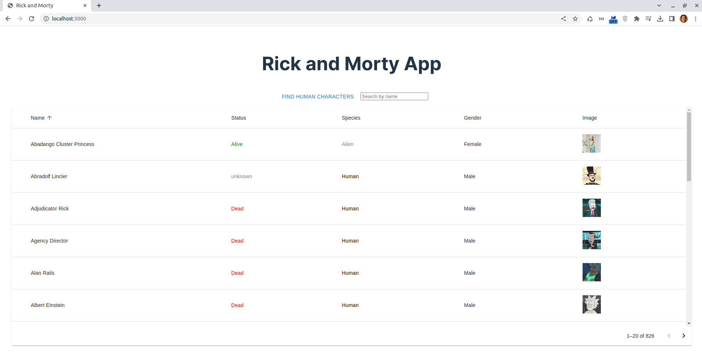
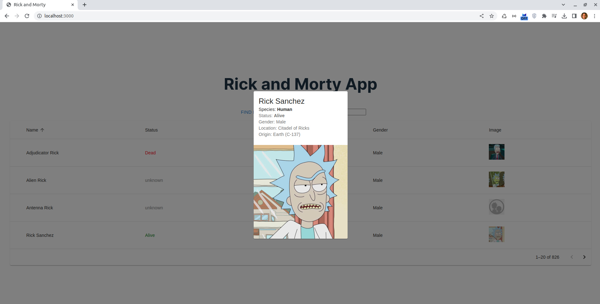

# Rick and Morty Human Character Finder

Este es un proyecto de frontend desarrollado en Next.js con Material UI y backend desarrollado en NestJs con GraphQl para ayudar a Rick and Morty a identificar a los humanos en su universo. Utiliza una API de GraphQL de Rick and Morty para mostrar una lista de personajes cuya especie sea "humano."
## Screens


## Instrucciones de Uso

A continuación, encontrarás las instrucciones sobre cómo configurar y ejecutar este proyecto en tu entorno local.

### Requisitos previos

Asegúrate de tener instalado lo siguiente:

- [Node.js](https://nodejs.org/) - Versiones 18 o superiores recomendadas
- [Git](https://git-scm.com/)

### Configuración

1. Clona este repositorio en tu máquina local usando el siguiente comando:

   ```bash
   git clone https://github.com/tuusuario/tuproyecto.git
   ```

2. Navega al directorio del Frontend del proyecto:

   ```bash
   
   cd rick-and-morty-project/rick-and-morty-frontend
      ```
    Navega al directorio del Backend del proyecto:

   ```bash
   
   cd rick-and-morty-project/rick-and-morty-graphql
      ```
3. Instala las dependencias en ambos proyectos:

   ```bash
   npm install
   ```

### Ejecución

1. Inicia el servidor de desarrollo:

   ```bash
   npm run dev
   ```

2. Abre tu navegador y ve a [http://localhost:3000](http://localhost:3000) para ver la aplicación en funcionamiento.

## Detalles del Proyecto

Este proyecto se divide en dos partes: el frontend y el backend.

### Frontend

- Desarrollado con Next.js, lo que proporciona una experiencia de usuario rápida y una navegación fluida.
- Utiliza Material UI para un diseño moderno y atractivo.
- Implementa paginación para mostrar los personajes en múltiples páginas.
- Está escrito en TypeScript para una mayor seguridad y facilidad de mantenimiento.
- Sigue las buenas prácticas de codificación y mantiene un código limpio y legible.

### Backend

- Creado con Express para proporcionar un endpoint que se conecta a la API de GraphQL desarrollado en Nestjs utilizando el endpoint de characters de Rick and Morty.
- La ruta `localhost:4000/graphql` se encarga de obtener los personajes humanos de la API de Rick and Morty.

## Puntos Extras

En este proyecto, además de cumplir con los requisitos básicos, hemos incorporado los siguientes puntos extras:

- Implementación de paginación para mostrar resultados de manera eficiente.
- Utilización de TypeScript para mejorar la integridad y claridad del código.
- Cumplimiento de buenas prácticas de codificación para un desarrollo mantenible y escalable.
- Un diseño creativo y atractivo gracias al uso de Material UI.
- Backend en Nestjs utilizando GraphQl
¡Esperamos que disfrutes explorando el universo de Rick and Morty y ayudando a identificar a los humanos!


## Contacto

Si tienes alguna pregunta o sugerencia, no dudes en ponerte en contacto con nosotros a través de adrianesqueiros@gmail.com.

¡Gracias por tu interés en este proyecto!